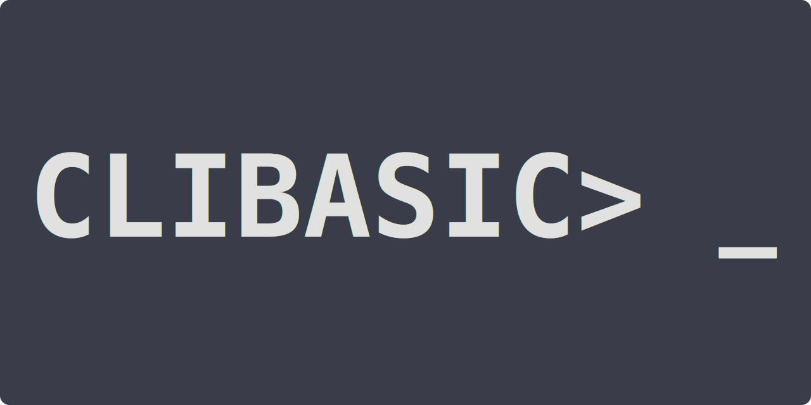

# CLIBASIC  
<!---->  
### <ins>C</ins>ommand <ins>L</ins>ine <ins>I</ins>nterface <ins>B</ins>eginners <ins>A</ins>ll-purpose <ins>S</ins>ymbolic <ins>I</ins>nstruction <ins>C</ins>ode  
CLIBASIC is a version of BASIC designed to run in the command line or terminal
<!---->  

<!---->  
### Required Packages/Programs  
#### Linux  
Debian (`apt`): `build-essential`, `libreadline-dev`  
Arch (`pacman`): `base-devel`, `readline`  
Alpine (`apk`): `build-base`, `readline-dev`  
#### Windows  
NT - 10 (download): [`MinGW`](http://mingw-w64.org/doku.php/download/mingw-builds), [`Make for Windows`](http://gnuwin32.sourceforge.net/packages/make.htm)  
7 - 10 (`choco`): `mingw`, `make`  
#### MacOS  
Mojave - Big Sur (`brew`): `gcc`, `make`, `readline`  
 
### Recommended Packages/Programs  
#### Linux  
Debian (`apt`): `git`  
Arch (`pacman`): `git`  
Alpine (`apk`): `git`  
#### MacOS  
Mojave - Big Sur (`brew`): `git`  
 
### Building and Running  
#### Linux/MacOS  
To build, use `make build`.  
To run, use `make run` or `./clibasic`.  
To build then run, use `make` (same as `make all`).  
#### Windows  
To build, use `make -f Makefile-Windows build`.  
To run, use `make -f Makefile-Windows run` or `.\clibasic.exe`.  
To build then run, use `make -f Makefile-Windows` (same as `make -f Makefile-Windows all`).  
 
### Notes  
- On Linux if CLIBASIC is not run in a terminal it will attempt to open in XTerm. CLIBASIC will only read arguments if it is run in a terminal.
- If the file `.clibasic_history` is present in the user's home directory CLIBASIC will automatically save history there. Run `_AUTOCMDHIST`, `_SAVECMDHIST` (without any arguments), or create the file `.clibasic_history` in your home/user folder to enable this feature. Remove the file to disable this feature.
- CLIBASIC will look for `AUTORUN.BAS` (and `autorun.bas` on Linux) in the user's home directory and run the file if present.
- MacOS is supported but readline will behave a bit differently due to a segmentation fault that has not been fixed yet.
- The development scripts are `build.sh` which is for testing if CLIBASIC compiles correctly for Linux and Windows, and `package.sh` which creates the zip files for making a CLIBASIC release.
